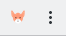
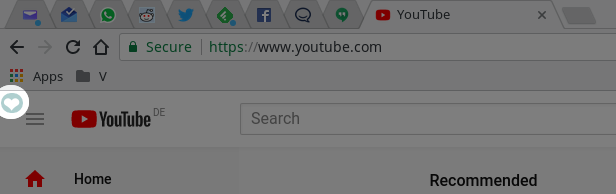
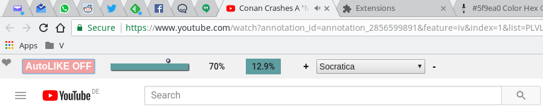
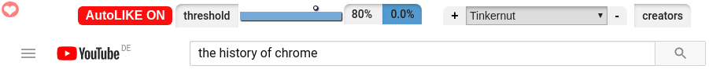
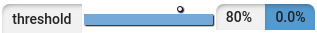

#YouTUBE Auto Like, Level 2

With this extension you can show your support for your favourite creators by adding their channel to your locally (in `localStorage`) managed list.
You will never forget to like a video you watched over a certain percentage that you can also setup.

The idea is simple, it's a little effort on your behalf but it makes a big difference for the creators on YouTUBE, because engagement is something that matters  for them in monetizing their work. 

## Here is how to start
 
Install the extension fom the Chrome Store: http://bit.ly/auto-like-level2

check for this icon: 

## Set it up

Well, no need, just open YouTUBE and you will be greeted with a little heart in the upper left corner:

- the extension is disabled by default:

- by clicking on the heart icon, you activate the controls:

- you can see the current state by the background color and the indication text:

- you cannot enable the extension if you are not logged into your account.
- you cannot enable the extension if you don't currently watch a video.

## Configure the plugin

- set the threshold for when you want to trigger the LIKE

on the right gauge you can see the current runtime of the video you are watching, it stops once liked

- the threshold setting is useless if no creator is added to the like list:

- you add the current creator you are watching by clicking the `+` sign
- you remove the creator currently shown in the list by clicking the `-` sign

## Configurations are stored locally

- remember that everything works only in your browser, nothing gets stored anywhere else, except your youtube account.
- once you clear your browser history (`localStorage`) you loose your channel / creator list will be lost.
 