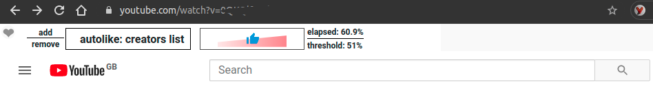
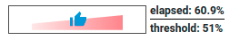
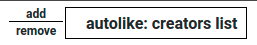
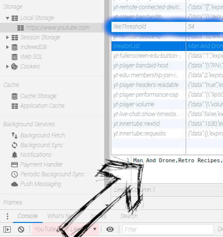

# YouTUBE Auto Like, Level 2

With this extension you can show your support for your favourite creators by adding their channel to your locally (in `localStorage`) managed list.

Never again, will you forget to like a video that you enjoyed over a certain percentage of its runtime. The **creator list** and **like threshold** are configurable. 

The idea is simple, a little effort on your behalf makes a big difference for the creators on YouTUBE, because `engagement` is something that matters for them in `monetizing` their work. 

## Here is how to start
 
Install the extension fom the Chrome Store: http://bit.ly/auto-like-level2

check for this icon: 

( a 32 x 32 pixel version of the image above - the desert fox)

## Set it up

Well, no need, just open YouTUBE and you will be greeted with a little heart icon in the upper left corner:

- by clicking on the heart icon, you activate the controls, these open up on top of the main menu and seach bar.

  

- you cannot enable the extension if you don't currently watch a video.

## Configure the plugin

- set the threshold for when you want to trigger the LIKE

on the right gauge you can see the current runtime of the video you are watching, it stops once liked

- the threshold setting is useless if no creator is added to the like list:

- you add the current creator you are watching by clicking the `add` text
- you remove the creator currently shown in the list by clicking the `remove` text

## Configurations are stored locally

- remember that everything works only in your browser, nothing gets stored anywhere else, except your `likes` meaning that the `like` you give a video will be saved by Google to your Youtube account (obviously).

- once you clear your browsers `localStorage` you also loose your **channel / creator list** and the preset **threshold** 

 